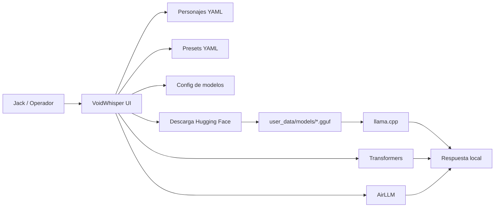
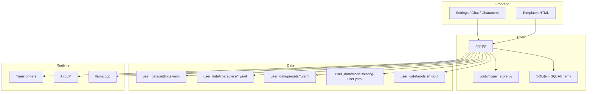
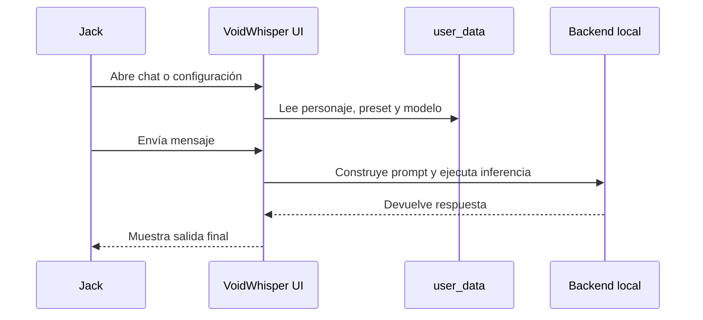

# VoidWhisper



**VoidWhisper** es una interfaz local de IA pensada para chat, roleplay, personajes editables y carga de modelos desde tu propio entorno. La idea es simple: una base oscura, elegante y potente, con gestión de modelos integrada directamente en el proyecto.

## Lo esencial

- Interfaz local con estética galáctica, oscura y cuidada.
- Support for personajes YAML editables.
- Presets de generación separados del personaje.
- Descarga directa de modelos y files desde Hugging Face.
- Backend híbrido: `Transformers`, `AirLLM` y `llama.cpp` cuando toca.
- Configuración persistente en `user_data/`.
- Exportación e importación de chats.
- Exportación e importación de personajes.
- Reintento y continuación de respuestas desde la vista de conversación.
- Editor de presets integrado.

## Vista General



## Arquitectura



## Flujo de uso



## Estructura de datos

VoidWhisper organiza sus datos locales así:

- `user_data/characters/`
  - personajes editables en YAML
- `user_data/presets/`
  - parámetros de temperatura, top_p, min_p, repetición, etc.
- `user_data/models/config-user.yaml`
  - reglas locales por extensión o patrón
- `user_data/settings.yaml`
  - defaults persistentes del entorno

## Motor de inferencia

### 1. Transformers

Pensado para modelos compatibles con `AutoModelForCausalLM`, con soporte de cuantización y carga estándar.

### 2. AirLLM

Útil si quieres dividir la carga en bloques y sobrevivir con hardware más justo.

### 3. llama.cpp / GGUF

Se activa para files `.gguf` locales. Si quieres usarlo de verdad, instala la dependencia opcional:

```bash
pip install -r requirements-gguf.txt
```

## Carpeta de modelos

Desde la screen de configuración puedes:

- escribir un repo de Hugging Face
- indicar un `.gguf` local
- descargar un archivo suelto o un repo completo al directorio del proyecto
- elegir el modelo local activo desde un selector
- ver los modelos y folders locales detectados

Desde el panel principal también puedes:

- exportar un chat a JSON
- importar un chat exportado
- exportar un personaje a JSON
- importar un personaje desde JSON
- reintentar la última respuesta de la IA
- continuar la generación desde el último contexto

## Installation rápida

```bash
git clone https://github.com/JackStar6677-1/VoidWhisper.git
cd VoidWhisper
python -m venv void_env
.\void_env\Scripts\activate
pip install -r requirements.txt
```

Si quieres soporte GGUF:

```bash
pip install -r requirements-gguf.txt
```

## Inicio

- `RUN_VOIDWHISPER.bat`
- `launch_voidwhisper.bat`
- `CREATE_DESKTOP_SHORTCUT.bat`

## Lo que incluye el proyecto

- `app.py`: backend principal Flask
- `voidwhisper_store.py`: capa de persistencia YAML y utilidades
- `templates/`: interfaz web
- `user_data/`: personas, presets, config y modelos locales
- `assets/`: branding visual del repo

## Mapa rápido

```text
VoidWhisper/
├─ app.py
├─ voidwhisper_store.py
├─ assets/
│  └─ voidwhisper-hero.svg
├─ templates/
├─ user_data/
│  ├─ characters/
│  ├─ presets/
│  ├─ models/
│  └─ settings.yaml
└─ requirements*.txt
```

## Notas

- El archivo `config-user.yaml` permite afinar patrones de carga locales.
- Los modelos pesados no se versionan; solo la configuración base.
- La estética está pensada para un tono oscuro, morado y dorado, con sensación cósmica.

## License

MIT License.

<!-- Updated for 2026 active baseline maintenance -->
